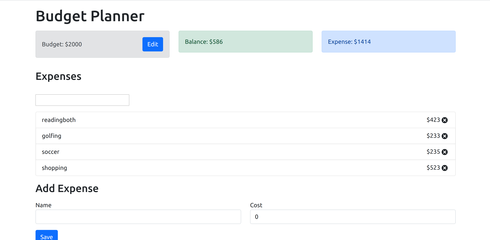

 

  <h1 align="center"> Budget App</h1>
 
  

    A React application
  

  

## Description 
A very minimalistic budget applcation which can be used to track expenses when compared to the avaialable amount at hand.

## Technologies

- React 
- Bootstrap
- Context Api

# Steps to get app started

In the project directory, you can run:

###### `yarn install`

###### `yarn start`

